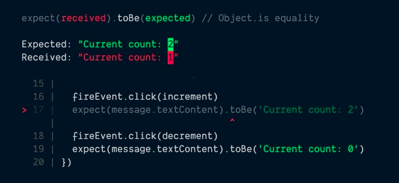
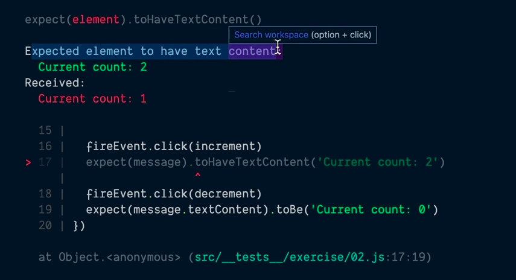

<div>
  <h1 align="center"><a href="https://epicreact.dev/testing">🧐 Testing React Applications 🚀 EpicReact.Dev</a></h1>
  <strong>
    Learn the essential tools and techniques to ship with confidence
  </strong>
  <p>
    In this hands-on workshop you'll learn everything you need to test React
    components and applications with ease and get the knowledge you need to ship
    your applications with confidence.
  </p>

  <a href="https://epicreact.dev">
    
  </a>
</div>

<hr />

<!-- prettier-ignore-start -->
[![Build Status][build-badge]][build]
[![All Contributors][all-contributors-badge]](#contributors)
[![GPL 3.0 License][license-badge]][license]
[![Code of Conduct][coc-badge]][coc]
<!-- prettier-ignore-end -->

## Prerequisites

- Read
  [But really, what is a JavaScript Test?](https://kentcdodds.com/blog/but-really-what-is-a-javascript-test)
- Read
  [But really, what is a JavaScript Mock?](https://kentcdodds.com/blog/but-really-what-is-a-javascript-mock)

## System Requirements

- [git][git] v2.13 or greater
- [NodeJS][node] `12 || 14 || 15 || 16 || 17`
- [npm][npm] v6 or greater

All of these must be available in your `PATH`. To verify things are set up
properly, you can run this:

```shell
git --version
node --version
npm --version
```

If you have trouble with any of these, learn more about the PATH environment
variable and how to fix it here for [windows][win-path] or
[mac/linux][mac-path].

## Setup

> If you want to commit and push your work as you go, you'll want to
> [fork](https://docs.github.com/en/free-pro-team@latest/github/getting-started-with-github/fork-a-repo)
> first and then clone your fork rather than this repo directly.

After you've made sure to have the correct things (and versions) installed, you
should be able to just run a few commands to get set up:

```
git clone https://github.com/kentcdodds/testing-react-apps.git
cd testing-react-apps
node setup
```

This may take a few minutes. **It will ask you for your email.** This is
optional and just automatically adds your email to the links in the project to
make filling out some forms easier.

If you get any errors, please read through them and see if you can find out what
the problem is. If you can't work it out on your own then please [file an
issue][issue] and provide _all_ the output from the commands you ran (even if
it's a lot).

If you can't get the setup script to work, then just make sure you have the
right versions of the requirements listed above, and run the following commands:

```
npm install
npm run validate
```

If you are still unable to fix issues and you know how to use Docker 🐳 you can
setup the project with the following command:

```
docker-compose up
```

It's recommended you run everything locally in the same environment you work in
every day, but if you're having issues getting things set up, you can also set
this up using [GitHub Codespaces](https://github.com/features/codespaces)
([video demo](https://www.youtube.com/watch?v=gCoVJm3hGk4)) or
[Codesandbox](https://codesandbox.io/s/github/kentcdodds/testing-react-apps).

## Running the app

For this one, there's not much to the app itself. The whole reason we have the
app is just so you can see examples of the components that we'll be testing.
You'll spend most of your time in the tests.

To get the app up and running, run:

```shell
npm start
```

This should start up your browser. If you're familiar, this is a standard
[react-scripts](https://create-react-app.dev/) application.

You can also open
[the deployment of the app on Netlify](https://testing-react-apps.netlify.app/).

## Running the tests

```shell
npm test
```

This will start [Jest](https://jestjs.io/) in watch mode. Read the output and
play around with it. The tests are there to help you reach the final version,
however _sometimes_ you can accomplish the task and the tests still fail if you
implement things differently than I do in my solution, so don't look to them as
a complete authority.

### Exercises

- `src/__tests__/exercise/00.md`: Background, Exercise Instructions, Extra
  Credit
- `src/__tests__/exercise/00.js`: Exercise with Emoji helpers
- `src/__tests__/final/00.js`: Final version
- `src/__tests__/final/00.extra-0.js`: Final version of extra credit

The purpose of the exercise is **not** for you to work through all the material.
It's intended to get your brain thinking about the right questions to ask me as
_I_ walk through the material.

### Helpful Emoji 🐨 💪 🏁 💰 💯 🦉 📜 💣 👨‍💼 🚨

Each exercise has comments in it to help you get through the exercise. These fun
emoji characters are here to help you.

- **Kody the Koala** 🐨 will tell you when there's something specific you should
  do
- **Matthew the Muscle** 💪 will indicate that you're working with an exercise
- **Chuck the Checkered Flag** 🏁 will indicate that you're working with a final
  version
- **Marty the Money Bag** 💰 will give you specific tips (and sometimes code)
  along the way
- **Hannah the Hundred** 💯 will give you extra challenges you can do if you
  finish the exercises early.
- **Olivia the Owl** 🦉 will give you useful tidbits/best practice notes and a
  link for elaboration and feedback.
- **Dominic the Document** 📜 will give you links to useful documentation
- **Berry the Bomb** 💣 will be hanging around anywhere you need to blow stuff
  up (delete code)
- **Peter the Product Manager** 👨‍💼 helps us know what our users want
- **Alfred the Alert** 🚨 will occasionally show up in the test failures with
  potential explanations for why the tests are failing.

## Notes

- When testing we should consider the two users, The end user that's interacting
  with our code (clicking buttons/etc), and the developer user that's actually
  using our code (rendering it, calling our functions, etc.). And we should
  avoid the [Test User](https://kentcdodds.com/blog/avoid-the-test-user)

### Simulating user clicks

- We can use `MouseEvent` with `dispatchEvent` to simulate a user clicking on a
  button, this way we have more control over the event.

```js
const event = new MouseEvent('click', {
  bubbles: true, // this way React can take advantage of Event Delegation
  cancelable: true, // that's the default when user clicks on a button
  button: 0, // left click, 1 for middle, 2 for right
})
```

### Libraries

- Use libraries such as `@testing-library` that implements all the boilerplate
  needed to interact with the DOM. Also includes handy helpers like autocleanup

- `@testing-library/jest-dom` is a library that adds helpful assertions to
  `jest` for interacting with the DOM, it should be preferred to use the helper
  methods because they will be mor useful with the error message i.e:

```js
// instead of:
expect(message.textContent).toBe('Current count: 1')
// we can do:
expect(message).toHaveTextContent('Current count: 1')
```

Before: 

With Jest DOM: 

- Our user won't care about the order of the elements or implementation details,
  so we don't either, prepare tests to work as if the information were displayed
  in any order:

So instead of:

```js
const [decrement, increment] = container.querySelectorAll('button') // if we change the order it breaks
const message = container.firstChild.querySelector('div') // if we move div to last position it breaks
```

You can do:

```js
const decrement = screen.getByRole('button', {name: /decrement/i}) // no matter where the button is as long the name has the word decrement
const increment = screen.getByRole('button', {name: /increment/i})
const message = screen.getByText(/current count/i)
```

- 📜 Read up on `screen` here:
  https://testing-library.com/docs/dom-testing-library/api-queries#screen

[Testing Implementation Details](https://kentcdodds.com/blog/testing-implementation-details)
and how to
[Avoid the Test User](https://kentcdodds.com/blog/avoid-the-test-user)

- Prefer to use userEvent over `fireEvent`, because when user clicks the buttons
  is also a bit of an implementation detail. We're firing a single event, when
  we actually should be firing several other events like the user does. When a
  user clicks a button, they first have to move their mouse over the button
  which will fire some mouse events. They'll also mouse down and mouse up on the
  input and focus it! Lots of events!

### Tips

- We can any time use `screen.debug()` to see what's going on in the DOM.

- Make use of builder functions to help your tests cases, and generate arbitrary
  data with libraries like faker, instead of fixed values:

```js
// instead of
const username = 'chucknorris'
const password = 'i need no password'

// you can do:
const {username, password} = buildLoginForm()

// ...
const buildLoginForm = () => {
  const username = faker.internet.userName()
  const password = faker.internet.password()

  return {username, password}
}
```

- Also you can make the builder functions to accept overrides, for testing other
  specific scenarios:

```js
const buildLoginForm = override => {
  const username = faker.internet.userName()
  const password = faker.internet.password()

  return {username, password, ...override}
}
```

- When testing api calls with libraries such as `msw` or `react-query` we can
  make use of `waitForElementToBeRemoved` to wait for the loading indicator to
  go away.

```js
test('handles server error', async () => {
  server.use(
    rest.get('/greeting', (req, res, ctx) => {
      return res(ctx.status(500))
    }),
  )

  render(<Fetch url="/greeting" />)

  userEvent.click(screen.getByText('Load Greeting'))

  await waitForElementToBeRemoved(() => screen.getByText('Loading...'))

  expect(screen.getByRole('alert')).toHaveTextContent('Oops, failed to fetch!')
  expect(screen.getByRole('button')).not.toHaveAttribute('disabled')
})
```

- When using `msw` its a good practice to share handlers between frontend and
  node environments:

```js
const server = setupServer(...handlers)
```

- Prefer using roles whenever you can:

```js
// instead of
// expect(screen.getByText(/password required/i)).toBeInTheDocument()

// we can do:
expect(screen.getByRole('alert')).toHaveTextContent(/password required/i)
```

- Make use of inline snapshots when dealing with contents that were to change in
  the future

```js
// isntead of this:
expect(screen.getByRole('alert')).toHaveTextContent(/password required/i)

// we can do:
expect(screen.getByRole('alert').textContent).toMatchInlineSnapshot(
  `"password required"`,
)
// note that the styles and html elements are irrelevant for the test itself, so we can grab the textContent for the assertion
```

- When we have two items that are related to each other, it's better to use
  variables, rather than the snapshot:

```js
const testErrorMessage = 'something went wrong'
server.use(
  rest.post(
    'https://auth-provider.example.com/api/login',
    async (req, res, ctx) => {
      return res(ctx.status(500), ctx.json({message: testErrorMessage}))
    },
  ),
)
// need to reset handlers after tests, otherwise next tests will be affected
render(<Login />)

userEvent.click(screen.getByRole('button', {name: /submit/i}))

await waitForElementToBeRemoved(() => screen.getByLabelText(/loading/i))

// here we are being more explicit about our intentions (we are telling the reader, that the two errors message are indeed related)
expect(screen.getByRole('alert')).toHaveTextContent(testErrorMessage)
```

- handy utility function for promisses:

```js
// it allows you to create a promise that you can resolve/reject on demand.
function deferred() {
  let resolve, reject
  const promise = new Promise((res, rej) => {
    resolve = res
    reject = rej
  })
  return {promise, resolve, reject}
}
// 💰 Here's an example of how you use this:
// const {promise, resolve, reject} = deferred()
// promise.then(() => {/* do something */})
// // do other setup stuff and assert on the pending state
// resolve()
// await promise
// // assert on the resolved state
```

- **act()** is a function that's built in to react-test-utils. In situations
  where we are directly calling a function that results in calling a state
  update or function, we have to use act.

```js
render(<Location />)
expect(screen.getByLabelText(/loading/i)).toBeInTheDocument()
await act(async () => {
  resolve()
  await promise
})
expect(screen.queryByLabelText(/loading/i)).not.toBeInTheDocument()
expect(screen.getByText(/latitude/i)).toHaveTextContent(
  `Latitude: ${fakePosition.coords.latitude}`,
)
expect(screen.getByText(/longitude/i)).toHaveTextContent(
  `Longitude: ${fakePosition.coords.longitude}`,
)
```

### The merits of mocking

One of the biggest challenges people face with testing is knowing what to test.
There are lots of reasons for that, but one big, flashing-lights reason is
mocking. Many people don't know when to add a mock version of code or have their
test run the actual code directly.

Mocking lets you fake it so you can make it. If you couldn't have a fake version
of certain modules or services, testing the checkout process of an app would
cost you a lot of money in credit card fees. Talk about paying a high price for
confidence! 🤑 So instead, we make a fake version of that credit card charging
service to avoid paying the fees.

But mocking comes with a cost of its own.

Mocking severs the real-world connection between what you're testing and what
you're mocking. Even if we have confidence that our code works with our fake
version of the credit card service, we can't have 100% confidence that our code
will work in production with the real version of the credit card service.

When you mock something, you're making a trade-off. You're trading confidence
for something else. For me, that something else is usually practicality-meaning
I wouldn't be able to test this thing at all, or it may be pretty
difficult/messy, without mocking. (Like in our credit card example.)

In my UI unit and integration tests, I have a rule. I never make actual network
calls; instead, I'll mock the server response by mocking the module responsible
for making the network calls. I'll also mock animation libraries to avoid
waiting for animations before elements are removed from the page. Other than
that, most of my UI tests are using the real production code. For E2E tests, I
avoid mocking anything (with the exception of the backend hitting fake or test
services and not actual credit card services, for example).

Saving a few milliseconds per test? That's not a good reason to mock. People
like shallow rendering-component mocking to the max-because it's faster. That's
true, but we're talking milliseconds faster. If it takes a long time to render
your entire component tree, sounds to me like you have a real performance bug in
your software that needs to be addressed. I realize that time adds up (50ms per
test \* 1000 tests = 50 seconds). But the less you mock, the fewer tests you
need, and trading confidence for a minute or two faster test suite is a bad
trade. 😵

There's a time and a place for mocking. And when you need to mock, Jest makes it
easy with some really sweet mocking utilities. In testingjavascript.com I'll
show you how to implement some of Jest's mocking capabilities in raw node so you
can get an idea of what's going on. It's brilliant. Here's an example of
simulating Jest's inline mock functionality in pure node:

```js
function fn(impl = () => {}) {
  const mockFn = (...args) => {
    mockFn.mock.calls.push(args)
    return impl(...args)
  }
  mockFn.mock = {calls: []}
  return mockFn
}

const utilsPath = require.resolve('~/utils')
require.cache[utilsPath] = {
  id: utilsPath,
  filename: utilsPath,
  loaded: true,
  exports: {
    getWinner: fn((p1, p2) => p1),
  },
}
```

Now, any code that requires that utils module will get the mock function version
of that module.

## Quotes

- The more your tests resemble the way your software is used, the more
  confidence they can give you. - Kent C. Dodds

## Contributors

Thanks goes to these wonderful people
([emoji key](https://github.com/kentcdodds/all-contributors#emoji-key)):

<!-- ALL-CONTRIBUTORS-LIST:START - Do not remove or modify this section -->
<!-- prettier-ignore-start -->
<!-- markdownlint-disable -->
<table>
  <tr>
    <td align="center"><a href="https://kentcdodds.com"><br /><sub><b>Kent C. Dodds</b></sub></a><br /><a href="https://github.com/kentcdodds/testing-react-apps/commits?author=kentcdodds" title="Code">💻</a> <a href="https://github.com/kentcdodds/testing-react-apps/commits?author=kentcdodds" title="Documentation">📖</a> <a href="#infra-kentcdodds" title="Infrastructure (Hosting, Build-Tools, etc)">🚇</a> <a href="https://github.com/kentcdodds/testing-react-apps/commits?author=kentcdodds" title="Tests">⚠️</a></td>
    <td align="center"><a href="https://relayr.io/"><br /><sub><b>Gautam Pahuja</b></sub></a><br /><a href="https://github.com/kentcdodds/testing-react-apps/commits?author=gautam-pahuja" title="Tests">⚠️</a></td>
    <td align="center"><a href="https://github.com/pom421"><br /><sub><b>pom421</b></sub></a><br /><a href="https://github.com/kentcdodds/testing-react-apps/commits?author=pom421" title="Documentation">📖</a></td>
    <td align="center"><a href="https://github.com/marcosvega91"><br /><sub><b>Marco Moretti</b></sub></a><br /><a href="https://github.com/kentcdodds/testing-react-apps/commits?author=marcosvega91" title="Code">💻</a></td>
    <td align="center"><a href="https://www.linkedin.com/in/pritamsangani/"><br /><sub><b>Pritam Sangani</b></sub></a><br /><a href="https://github.com/kentcdodds/testing-react-apps/commits?author=PritamSangani" title="Code">💻</a></td>
    <td align="center"><a href="https://github.com/emzoumpo"><br /><sub><b>Emmanouil Zoumpoulakis</b></sub></a><br /><a href="https://github.com/kentcdodds/testing-react-apps/commits?author=emzoumpo" title="Documentation">📖</a></td>
    <td align="center"><a href="http://peter.hozak.info/"><br /><sub><b>Peter Hozák</b></sub></a><br /><a href="https://github.com/kentcdodds/testing-react-apps/commits?author=Aprillion" title="Code">💻</a></td>
  </tr>
  <tr>
    <td align="center"><a href="https://github.com/milamer"><br /><sub><b>Christian Schurr</b></sub></a><br /><a href="https://github.com/kentcdodds/testing-react-apps/commits?author=milamer" title="Code">💻</a> <a href="https://github.com/kentcdodds/testing-react-apps/commits?author=milamer" title="Documentation">📖</a></td>
    <td align="center"><a href="https://github.com/tiodan81"><br /><sub><b>Dan Schwartz</b></sub></a><br /><a href="https://github.com/kentcdodds/testing-react-apps/commits?author=tiodan81" title="Documentation">📖</a></td>
    <td align="center"><a href="http://wbeuil.com"><br /><sub><b>William BEUIL</b></sub></a><br /><a href="https://github.com/kentcdodds/testing-react-apps/commits?author=wbeuil" title="Documentation">📖</a></td>
    <td align="center"><a href="https://vk.com/vasilii_kovalev"><br /><sub><b>Vasilii Kovalev</b></sub></a><br /><a href="https://github.com/kentcdodds/testing-react-apps/issues?q=author%3Avasilii-kovalev" title="Bug reports">🐛</a></td>
    <td align="center"><a href="https://github.com/RobbertWolfs"><br /><sub><b>Robbert Wolfs</b></sub></a><br /><a href="https://github.com/kentcdodds/testing-react-apps/issues?q=author%3ARobbertWolfs" title="Bug reports">🐛</a></td>
    <td align="center"><a href="http://twitter.com/peramanathan"><br /><sub><b>Peramanathan Sathyamoorthy</b></sub></a><br /><a href="https://github.com/kentcdodds/testing-react-apps/commits?author=p10ns11y" title="Tests">⚠️</a> <a href="https://github.com/kentcdodds/testing-react-apps/commits?author=p10ns11y" title="Code">💻</a></td>
    <td align="center"><a href="https://michaeldeboey.be"><br /><sub><b>Michaël De Boey</b></sub></a><br /><a href="https://github.com/kentcdodds/testing-react-apps/commits?author=MichaelDeBoey" title="Code">💻</a></td>
  </tr>
  <tr>
    <td align="center"><a href="https://bartwijnants.be/"><br /><sub><b>Bart Wijnants</b></sub></a><br /><a href="https://github.com/kentcdodds/testing-react-apps/commits?author=bartw" title="Documentation">📖</a></td>
    <td align="center"><a href="https://www.daleseo.com"><br /><sub><b>Dale Seo</b></sub></a><br /><a href="https://github.com/kentcdodds/testing-react-apps/commits?author=DaleSeo" title="Code">💻</a> <a href="https://github.com/kentcdodds/testing-react-apps/commits?author=DaleSeo" title="Documentation">📖</a></td>
    <td align="center"><a href="https://github.com/falldowngoboone"><br /><sub><b>Ryan Boone</b></sub></a><br /><a href="https://github.com/kentcdodds/testing-react-apps/commits?author=falldowngoboone" title="Documentation">📖</a></td>
    <td align="center"><a href="https://bobowen.tech"><br /><sub><b>Bob Owen</b></sub></a><br /><a href="https://github.com/kentcdodds/testing-react-apps/commits?author=onetruebob" title="Code">💻</a> <a href="https://github.com/kentcdodds/testing-react-apps/commits?author=onetruebob" title="Documentation">📖</a></td>
    <td align="center"><a href="http://www.sharpbites.com"><br /><sub><b>alberto</b></sub></a><br /><a href="https://github.com/kentcdodds/testing-react-apps/commits?author=alberto" title="Documentation">📖</a></td>
    <td align="center"><a href="https://github.com/marioleed"><br /><sub><b>Mario Sannum</b></sub></a><br /><a href="https://github.com/kentcdodds/testing-react-apps/commits?author=marioleed" title="Code">💻</a></td>
  </tr>
</table>

<!-- markdownlint-restore -->
<!-- prettier-ignore-end -->

<!-- ALL-CONTRIBUTORS-LIST:END -->

This project follows the
[all-contributors](https://github.com/kentcdodds/all-contributors)
specification. Contributions of any kind welcome!

## Workshop Feedback

Each exercise has an Elaboration and Feedback link. Please fill that out after
the exercise and instruction.

At the end of the workshop, please go to this URL to give overall feedback.
Thank you! https://kcd.im/tra-ws-feedback

<!-- prettier-ignore-start -->
[npm]: https://www.npmjs.com/
[node]: https://nodejs.org
[git]: https://git-scm.com/
[build-badge]: https://img.shields.io/github/workflow/status/kentcdodds/testing-react-apps/validate/main?logo=github&style=flat-square
[build]: https://github.com/kentcdodds/testing-react-apps/actions?query=workflow%3Avalidate
[license-badge]: https://img.shields.io/badge/license-GPL%203.0%20License-blue.svg?style=flat-square
[license]: https://github.com/kentcdodds/testing-react-apps/blob/main/LICENSE
[coc-badge]: https://img.shields.io/badge/code%20of-conduct-ff69b4.svg?style=flat-square
[coc]: https://github.com/kentcdodds/testing-react-apps/blob/main/CODE_OF_CONDUCT.md
[emojis]: https://github.com/kentcdodds/all-contributors#emoji-key
[all-contributors]: https://github.com/kentcdodds/all-contributors
[all-contributors-badge]: https://img.shields.io/github/all-contributors/kentcdodds/testing-react-apps?color=orange&style=flat-square
[win-path]: https://www.howtogeek.com/118594/how-to-edit-your-system-path-for-easy-command-line-access/
[mac-path]: http://stackoverflow.com/a/24322978/971592
[issue]: https://github.com/kentcdodds/testing-react-apps/issues/new
<!-- prettier-ignore-end -->
